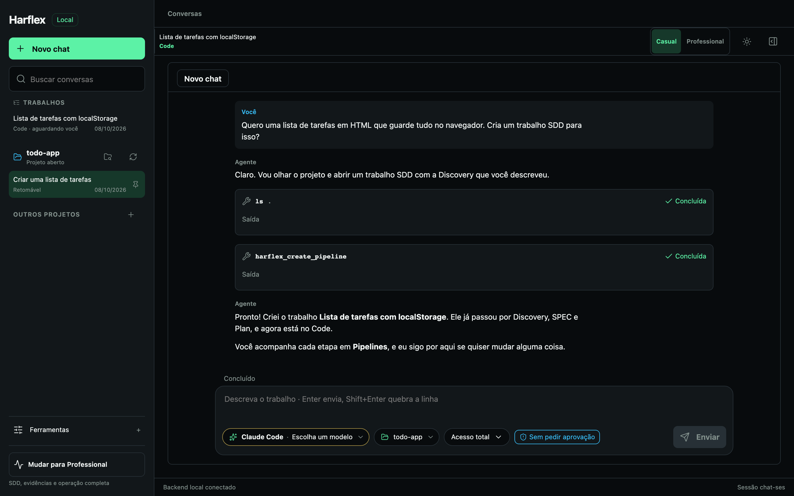
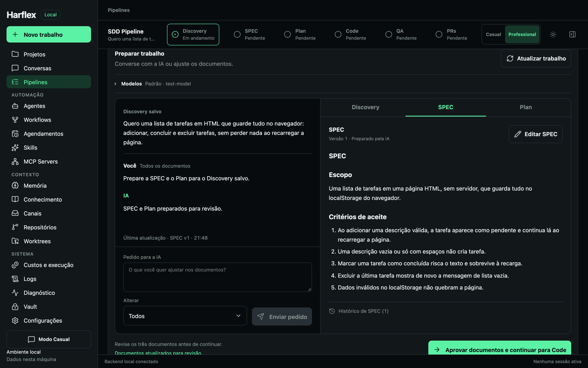
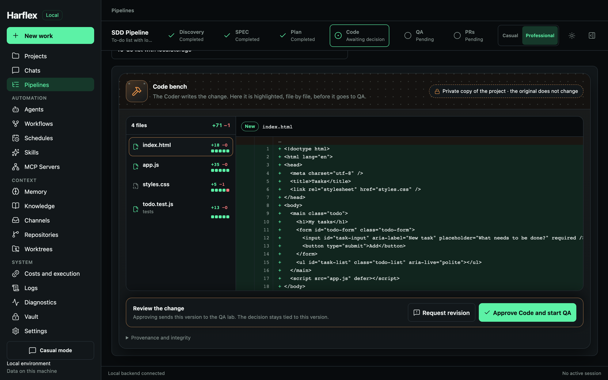
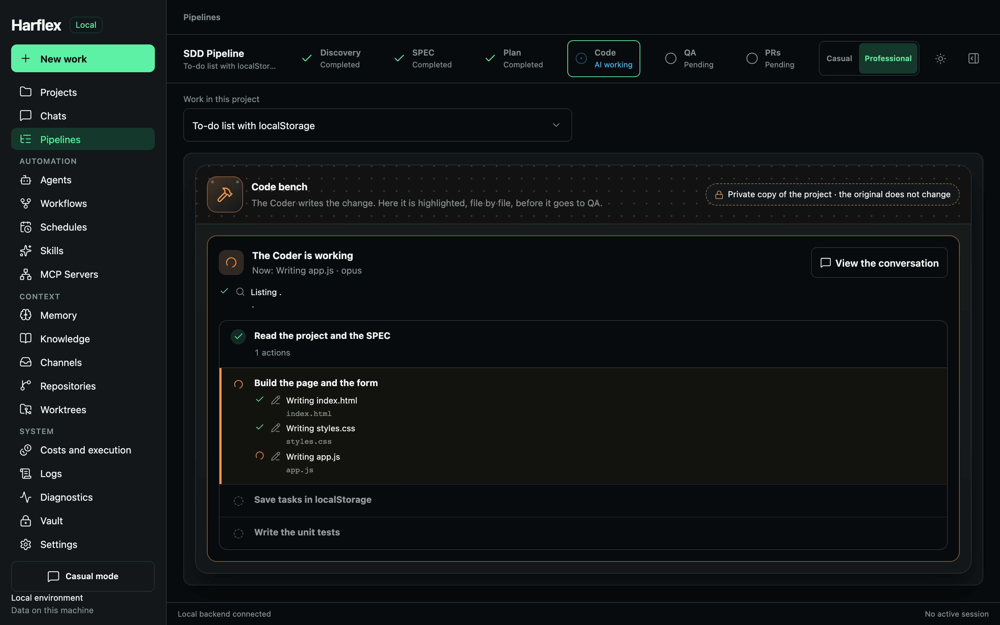
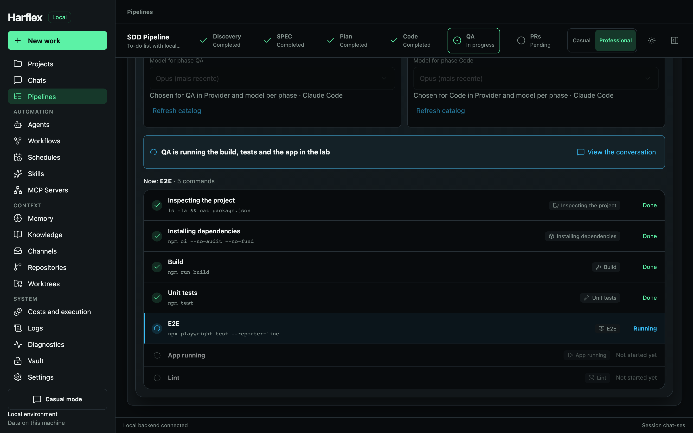
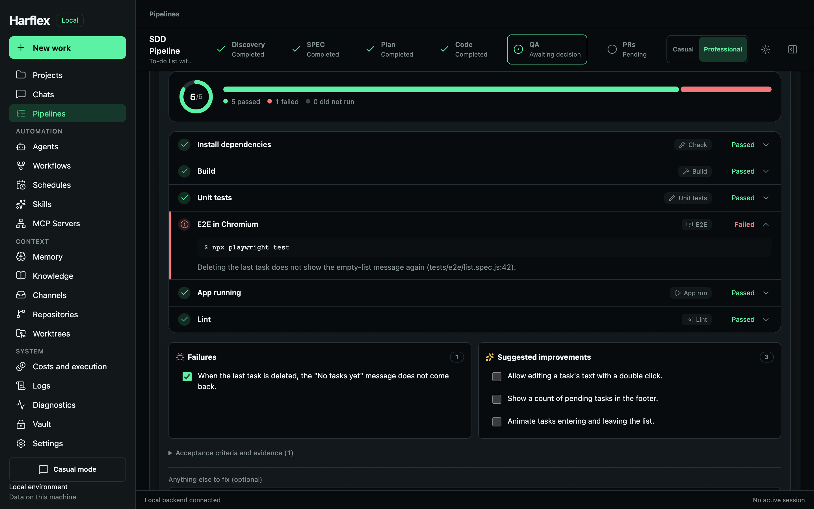
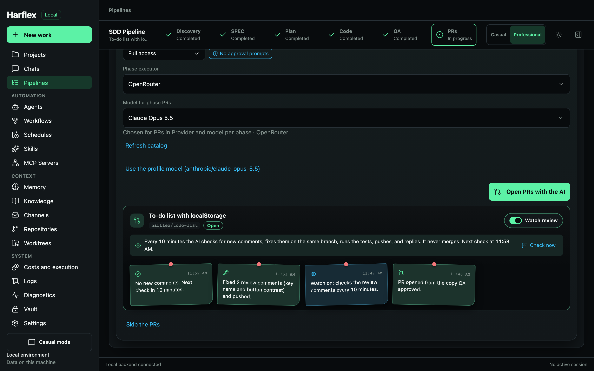

# Harflex

Local-first desktop harness built with Go + Wails v3 and React, oriented toward agent sessions and SDD evidence. The app implements a SQLite catalog, the system vault, an event journal, an OpenAI-compatible provider, CLI adapters, and tools with an approval policy. The 18 menu areas have their own actions, including SDD pipelines, project memory, agents, skills, MCP, workflows, Git, worktrees, schedules that run while the app is open, channels backed by local folders, and text search over project knowledge. The [product plan](PRODUCT.md) records deeper features that are still pending; this version does not claim full parity with Pi or LionClaw.

## Download

Download the installer from the [latest release](https://github.com/Flllexa/harflex/releases/latest): `.dmg` for macOS (Apple Silicon and Intel), `.exe` for Windows, and `.AppImage`, `.deb`, or `.rpm` for Linux. The macOS app is signed with a Developer ID and notarized by Apple, so it opens normally. The Windows and Linux installers are not signed.

**Updates:** when a newer release is published, an **Update vX.Y.Z** button appears beside the logo. One click downloads the installer, checks it against the release's `SHA256SUMS.txt`, replaces the app and reopens it. On macOS the new app must carry a valid signature from the same Developer ID team as the running one, and Gatekeeper must accept it. On Windows it starts the installer; on Linux it replaces the AppImage; a `.deb` or `.rpm` install, or a development build, shows **Download** instead and opens the release page. The check reads the public GitHub releases of this repository and sends nothing else; set `HARFLEX_NO_UPDATE_CHECK=1` to turn it off.

## What it looks like

The screenshots below are of the app itself, using a demo project (`make screenshots` regenerates them).

**Chat:** an agent creates the SDD work from the conversation, and the work appears in the sidebar with the stage it is in.



**Discovery, SPEC, and Plan:** you write the Discovery and the AI prepares the SPEC and the Plan; you can chat or edit before approving.



**Code:** Coder works on a private copy of the project, and the change appears file by file before it goes to QA.



**Code running:** open the Code stage while the Coder works and you see the plan it declared, the step it is on and what it does in each step. You can leave and come back at any time.



**QA running:** QA actually runs the installation, the build, the tests, the E2E suite, and the app running, in a lab of its own, and shows each command as it runs.



**QA report:** failures and improvements become a checklist to mark; the fixes go back to Code, and QA runs again on its own until it passes.



**PRs:** the AI opens the pull request, and the watcher checks the review comments every 10 minutes, fixes them, and pushes on its own.



## Local development

Prerequisites: Go with preferred toolchain 1.26.8, Node 22/npm, the platform's native dependencies, and Wails **v3.0.0-beta.26**. The module keeps `go 1.25.0`; `toolchain go1.26.8` suggests a toolchain, but it does not pin the exact compiler or replace security updates. Check the effective version with `go version`.

### Make shortcuts

On macOS/Linux, or on Windows with GNU Make and a POSIX shell (Git Bash/WSL), use `make help` to list the targets. The Makefile builds the Wails CLI pinned in `go.mod` into `bin/` (ignored by Git); it does not require a global `wails3` or `task`.

```bash
make setup
make setup-e2e        # once, for Playwright
make dev
make test             # Go -race, frontend, and Playwright
make check            # also tidy, diff, and release gates
make build            # app for the current platform
make package          # package for the current platform
make installers       # installers: .dmg on macOS, NSIS .exe on Windows, AppImage/deb/rpm on Linux
make screenshots      # README screenshots (docs/screenshots) with demo data
make release VERSION=0.2.0  # creates the tag v0.2.0; GitHub builds and publishes the release
```

To run `make dev` alongside the installed app (or another worktree) without touching the real data, point it at a directory of its own: `HARFLEX_DATA_DIR=/tmp/harflex-dev make dev`. The SQLite catalog, Code's private directory, the Code run copies of pipelines, and the single-instance lock now depend on that directory; without the variable, behavior is unchanged (`<user config>/Harflex`). To explore the interface in the browser with the real Go backend (for example, for automation), build with `go build -tags server -o bin/harflex-server .` and run with `FRONTEND_DEVSERVER_URL=http://127.0.0.1:9245 WAILS_SERVER_PORT=9246 HARFLEX_DATA_DIR=... bin/harflex-server` alongside `npm run dev -- --port 9245`; native dialogs (choosing a folder or file) exist only in the desktop app.

Use `make build TARGET_OS=windows` (or `linux`/`darwin`) only when the platform's dependencies and cross-compilation are configured. `make package` on macOS applies the local ad hoc signature defined in the Taskfile; it does not do Developer ID signing, notarization, push, or publishing. Build and package steps may regenerate bindings, icons, or tracked module files; check `git status` and the diff after running them. In PowerShell without a POSIX shell, use the `wails3`/Taskfile commands below.

`make installers` builds the installers for the current platform, or for `TARGET_OS`:
- **macOS:** `bin/harflex.dmg`, with the app and the shortcut to Applications. The architecture is this machine's; `UNIVERSAL=1` builds a single `.dmg` for Apple Silicon and Intel. The signature is ad hoc, with no Developer ID or notarization, so on another Mac the first opening requires right-click > Open.
- **Windows:** `build/windows/nsis/harflex-installer.exe`, which needs `makensis` (`brew install makensis` on macOS).
- **Linux:** AppImage, `.deb`, `.rpm`, and AUR package in `bin/`.

The icon is in `build/appicon.png` (the `.icns` and `.ico` are generated from it with `wails3 generate icons`) and in `build/appicon.icon` (Icon Composer format). The app uses the `.icns`: the new macOS `Assets.car` format requires full Xcode (`actool`) to be generated, which is why `Info.plist` does not declare `CFBundleIconName`.

```sh
go install github.com/wailsapp/wails/v3/cmd/wails3@v3.0.0-beta.26
cd frontend
npm ci
cd ..
wails3 dev
```

Add the Go binary install directory to PATH: the value of `go env GOBIN` if it is set, or `bin` inside `go env GOPATH`. There is no dependency on absolute paths of the development machine. In PowerShell, use `$env:PATH` to append that directory. The setup-go action already includes it on the runners.

macOS requires the Xcode Command Line Tools. Windows requires WebView2 to run the app. On Ubuntu 24.04, install `build-essential pkg-config libgtk-4-dev libwebkitgtk-6.0-dev`, following [Wails](https://v3.wails.io/getting-started/installation/) and the doctor for the pinned version. `wails3 doctor` checks local dependencies.

## Verification and build

```sh
wails3 task test:go
wails3 task test:frontend
wails3 task check:tidy
wails3 task check:diff
node --test scripts/release-gates.test.mjs
cd frontend
npx playwright install chromium
npm run test:e2e
cd ..
wails3 build
```

`wails3 task check` aggregates the gates after dependencies and the browser are installed. To use an installed Chrome, set `PLAYWRIGHT_CHANNEL=chrome` in the environment. In PowerShell: `$env:PLAYWRIGHT_CHANNEL = 'chrome'`; in bash/zsh: `PLAYWRIGHT_CHANNEL=chrome npm run test:e2e`. Without the variable, Playwright uses its own Chromium. `test:e2e` in the Taskfile enables CI and uses port 9345 by default; set `HARFLEX_E2E_PORT` to isolate simultaneous worktrees.

`check:diff` checks local changes and, when `origin/main` is available, every commit since the merge-base. Without the remote, run `git diff --check <base-local>..HEAD` with the base commit of your branch. In CI, the gate uses the PR base or the commit before the push; without that commit, it uses the merge-base with the default branch, or compares the whole snapshot against an empty tree.

When it opens, the app reopens the project used last (the catalog lists the most recent first); if the folder no longer exists, the opening screen offers the recent projects. The session list uses a preview of the first message as the title and collapses the SDD's internal sessions. In conversations, agent responses are rendered as Markdown without raw HTML (links only `http(s)`/`mailto`, no remote images are fetched), approvals show the content to be written or the full command before the decision, and the composer always stays visible.

The E2E tests at 320×720, 768×1024, 900×700, and 1440×900 use a **synthetic** facade. They do not call providers, shell, real files, or Wails. The `foundation` fixture persists only synthetic journal data in sessionStorage and returns the same ID after the setup is reopened, exercising replay after a reload. The UI lists and reopens sessions; these tests validate the visual flow and the replay, but they do not prove resumption on a real CLI. Screenshots and reports are kept in `frontend/test-results` and `frontend/playwright-report`, which Git ignores. A plain browser without the fixture reports that the backend is unavailable.

## Local schedules

Daily or one-time schedules store the IANA time zone and the local time in SQLite. The next run is computed in the chosen time zone; a daily time that does not exist because of a daylight saving time change is skipped, and a non-existent or ambiguous time for a one-time run is refused. Each job runs a prompt or the steps of a workflow, and records its state, a safe error, and the session/workflow links. A job waiting for human approval is not completed automatically; after the decision, the scheduler reconciles the session and continues the remaining steps while the app is open. Only one active job per schedule is admitted; a manual trigger is allowed even when the schedule is paused. The screen shows the 200 most recent jobs per project.

**The app must be open for jobs to run.** There is no operating system service, background startup, or execution with the app closed. When it is reopened, the "Skip" policy records a skipped job for the missed time; "Run once on reopen" collapses missed times into a single job. While the app is open, delays longer than one minute also count as missed under the "Skip" policy. Jobs that were started before an unexpected shutdown are marked as interrupted and are not repeated automatically, because they may already have produced effects. Cancelling an active job records a request until the child's result is confirmed; a failure of that request stays visible and does not declare the job cancelled. On a normal close, the scheduler requests cancellation and waits for the active job before closing SQLite.

Schedules with a CLI backend require explicit consent in the form: the CLI runs with the authority of its own process, and Harflex's tool policy does not control its internal actions. The prompt definition is saved in the local catalog; avoid putting credentials in the text.

## Subagent delegation

A delegation starts from the current session and creates a child with a snapshot of the chosen agent and backend. The child, its link to the parent, the redacted task, and the journal event are written in a single transaction; a failure to record does not leave an orphan session. The tree shows only a preview of up to 280 characters, and the full text stays in the local journal. The interface generates a random ID per attempt and keeps only that token in local storage until the response is confirmed. Repeating the attempt with the same ID, parent, agent, and task returns the child that was already registered, including after a restart; reusing the ID with a different task or agent is refused. In that case Harflex opens the history but **does not run it again**: if the task has not started yet, use "Prepare delegated task" to put it in the draft and review it before sending. A task that has not started yet stays visible in the agent tree after a restart. If redaction hid a secret, complete the text before sending. After confirmation, a new "Delegate" action gets another ID and may intentionally run the same task in another child.

Each child accepts at most three admitted attempts of `Prompt`, reserved in SQLite before the call is handed to the runner; a crash, failure, or cancellation after the reservation consumes an attempt. A rejection because the session is busy or the backend cannot be resumed releases the reservation. The counter persists across restarts. Each active stretch of `Prompt` or `Approve` gets a five-minute deadline, also applied to the Codex/OpenCode process through context cancellation. The wait for a human decision between stretches does not count against that deadline; therefore five minutes is **not** the maximum total duration of a turn with approvals. The Go loop still limits a run to 50 rounds and 64 tool calls per response. These limits are not a cost or token ceiling, do not revert effects already made, and do not restrict a CLI's internal actions before cancellation. The interface shows the counter, the limit, and the deadline both in the tree and in the child's conversation.

The persisted preview removes only the credentials that the session knew at the time of creation. It does not detect arbitrary secrets typed into the task; review the text before delegating, especially when using remote providers or CLIs. To check for divergent retries, the local SQLite also stores a SHA-256 of the original prompt: this hash is not sent to the UI, but anyone who can already read the database can test guesses for short or predictable tasks. Protect the user data directory.

The link to the parent's SDD pipeline is not yet formally inherited by the child: the tree lets you go back to the parent session, but the child's conversation does not appear as a stage session and does not automatically feed the pipeline's evaluation. Review your evidence and attach it to the appropriate stage.

## Local channels

In **Channels**, set up a folder relative to the open project, for example `channels/team`. Harflex creates `inbox/` and `outbox/` under it. Put `.txt` or `.md` files in the inbox and choose **Import inbox** to register the messages; write a reply and choose **Send reply** to publish a `.md` file in the outbox. None of these actions happen in the background, and the channel uses no network or credentials.

Each read accepts up to 500 entries per import and 64 KiB of UTF-8 text per file. If the inbox exceeds that limit, move, organize, or remove files from the folder manually before importing again; Harflex never deletes the originals. The interface shows the 500 most recent messages; the full history stays in SQLite. The same source, unchanged, does not duplicate the record. A send gets a stable ID per draft and channel: after a failure, repeating the action checks the same output and never overwrites different content. The draft is cleared only after the delivery appears when the history is read again.

## Worktrees

**Worktrees** (Context menu) lists every working folder of the open project's repository and judges each one. **Can delete** appears only when the worktree is clean (no changes or new files), has no commits that the base branch lacks, has no Git operation in progress, is not locked, has no program using the folder (terminal, editor, dev server, agent session, or Harflex itself running from there), and is neither the main worktree nor the open project. In any other case **Cannot delete** appears, with the reasons: unsaved changes, unmerged commits, a detached HEAD with loose commits, a missing folder, a lock, or a merge or rebase in progress. The same control appears in the project header on every screen: branch, what is pending, the verdict, and the shortcuts. Under **All projects**, the page shows the worktrees of every active project (excluding archived ones), one group per repository; projects that are worktrees of the same repository join the same group. The actions of each group go through the project that represents the repository, and the open project's worktree is never offered for deletion there. The check for programs in use runs once for all repositories.

For a worktree with pending work, **Save and merge with AI…** first keeps a safety copy of what is there (a commit under `refs/harflex/worktree-saves/…`, made without touching the worktree's files, index, or branch), then opens a conversation in the main project and asks the AI to commit what is pending and merge the branch into the base. The conversation becomes the open project, and each command follows the normal approval policy. The AI deletes nothing: when the run ends, Harflex judges the worktree again and removes the folder (and the already merged branch, if requested) only if everything is saved and merged and the option "Delete the worktree when everything is saved and merged" is checked. If anything remains, nothing is deleted and the notice says what is missing; **Check now** repeats the check, and continuing the conversation with the AI makes Harflex check again when it finishes. In Casual mode the notice appears in the conversation itself.

Limits. Deletion never uses `--force`, and the backend judges again at the moment of deletion, refusing anything that changed since the list. Git-ignored items (such as `node_modules/` or `.env.local`) are not in any commit and are deleted only with explicit confirmation. The safety copy includes new files that Git does not ignore, even a forgotten `.env` outside `.gitignore`, and it stays only in the local repository; the AI is instructed not to commit them. Save with AI requires the main worktree to be clean, because the merge happens there. When the main worktree has changes, it offers **Commit with AI** itself: after the safety copy, the AI only commits the changes on the base branch, without merging, switching branches, or deleting anything, and Harflex checks that nothing pending remains. This frees the other worktrees. A CLI as the AI backend is accepted only with a default model saved in Settings and confirmed by the catalog; API providers have no such requirement. The check for programs in use looks for processes whose working directory or command line is inside the folder (`lsof` and `ps` on macOS, `/proc` on Linux), costs about one second per read, and does not exist on Windows, where the system refuses to remove an open folder. Locked worktrees (`git worktree lock`) are released only manually, and cleaning up the records of missing folders (`git worktree prune`) leaves the locked ones alone.

## Conversations in Casual mode

The Casual sidebar shows the conversations of all active projects, grouped by project, as in Codex: the open project at the top, with the full list and search, and the other projects below, each with its most recent conversations. Opening a conversation from another project switches projects first. Each conversation can be pinned; pinned conversations appear in their own section at the top, with the project name. On the message card, next to the permissions control, a pill with the project name switches projects in one click; on the new chat screen, whatever was already typed goes along. Each project has **Open folder** (in Finder, Explorer, or the file manager) and, in the other projects, **New chat** in that project.

## Terminal in the side panel

The sun or moon button in the header switches between the light and dark themes. The choice is saved on this computer; without a choice, the app follows the system theme. The terminal stays dark in both themes.

An icon in the corner of the header opens and closes the side panel, which has the **Activity** and **Terminal** tabs and remembers the last one used. The terminal is your shell (`$SHELL -l`, with `TERM=xterm-256color`) opened in the project folder, under your account, without a sandbox: it is not an agent. It opens only the first time the tab is shown, keeps running when the panel closes or the tab changes, and redraws the recent output (up to 2 MiB) when you return; **New terminal** ends the current one and opens another. Output arrives as an event (`harflex:terminal`), in base64 so that characters are not split; the shell ends together with the app. On Windows the terminal is not supported yet.

The **QA** phase is a lab. QA runs the project's checks for real: installation, build, unit tests, E2E, and the app running. It works in a copy of its own, made from the Code copy, with terminal and network access and without asking for approval of each command; nothing it installs or generates goes into the patch. The report includes:
- the checks, with the command and the result of each;
- the **failures**, which come already marked;
- the **suggested improvements**, which you mark if you want them.

**Fix the selected** sends the marked items (and an optional note) back to Code, which continues in the same copy. From there the cycle runs on its own in the background: Code fixes, the cycle approves the fix, and QA runs again. It repeats while there are failures, for up to three fix rounds, and it stops when QA passes. If the model finishes without the report, the cycle asks for the report again in the same conversation.

In the **PRs** phase, **Approve and open the PRs** applies the approved patch and opens the chat that creates the branch, makes the commit, the push, and the PR. Each PR opened is recorded and appears in a card, with the link, branch, state, and a timeline. With **Watch review** on, every 10 minutes the same chat:
- reads the new review comments;
- fixes them on the same branch, runs the tests, and pushes;
- replies to each comment.

The watcher never merges or force-pushes, and it stops when the PR is merged or closed. It needs Full access on the project; without it, the card warns and offers the permissions selector.

The conversation agent knows it is inside Harflex, whatever the engine (API model, Codex, or Claude Code). It receives instructions about the platform: Casual and Professional modes, the SDD phases, and who approves each one. These instructions reach Codex as `developer_instructions` and Claude Code as `--append-system-prompt`, on every turn, so they also apply to older conversations. The global configuration of the CLIs (`~/.codex`, `~/.claude`: skills, AGENTS.md, MCPs) still applies, but Harflex takes priority when there is a conflict.

In conversations, the agent has three Harflex tools, always restricted to the conversation's project:
- `harflex_create_pipeline` creates an SDD pipeline with the Discovery agreed in the chat;
- `harflex_list_pipelines` lists the project's pipelines;
- `harflex_get_pipeline` reads a pipeline, with its phases, status, and, if requested, the documents.

Approving and advancing phases remains the person's job, on the Pipelines screen. When the agent creates a pipeline, a notice appears in the corner with the **Open** button.

API models receive these tools directly. Codex and Claude Code receive them through Harflex's local MCP server:
- it listens only on `127.0.0.1`, refuses browsers, and each conversation has its own token;
- the token reaches the CLI through the `HARFLEX_MCP_TOKEN` variable, never through the arguments;
- in Codex, only the Harflex tools are pre-approved.

The **Activity** tab draws the latest request as a flow ([React Flow](https://reactflow.dev)): the request at the top, the plan's steps along the spine (done, now, pending) and, branching from each step, the actions with their text, such as "Reading validate.ts", "Writing style.css", or "Running a command" with the command below it. Each action shows whether it is queued, in progress, waiting for approval, done, or failed, and the flow ends with the result. The camera follows what is happening until you move the canvas; **Follow** resumes following. The plan comes from three sources:
- the `update_plan` tool, which API agents receive in conversations and in pipeline Code (including agents with a restricted tool list, because it changes nothing);
- the Codex task list;
- the Markdown checklist (`- [ ]` / `- [x]`) that Claude Code is instructed to publish, because in `-p` mode it has no plan tool. When it only republishes the checklist at the end, each action goes to the started step that cites its file.

Without a plan, the actions hang off the request. Raw tool errors stay only in the conversation. The side panel has an adjustable width: drag the left edge, or use the arrow keys on the splitter; double-clicking returns to 360 px. The width is saved on this computer and is limited while the window is narrow.

## Project memory

When you open a project that has never been read, Harflex asks whether the AI should read it; with a yes, the AI reads what the project already has, and Harflex stores the result as the project memory, so that Discovery, SPEC, and Plan already know the technologies, domains, repositories, and services without the person having to explain them. The collection is done by Harflex itself, without AI: READMEs, `AGENTS.md`, `CLAUDE.md`, `docs/**/*.md`, manifests (`go.mod`, `package.json`, `pom.xml`, `build.gradle`, `template.yaml`, `Dockerfile`, OpenAPI and AsyncAPI, GitHub workflows, and others), the first two layers of folders, and the Git repositories inside the project, with the remote (without user or password) and the branch. Each repository's guide and manifests come before any deeper document. Each file is cut (8 KiB at the root, 3 KiB in folders) and the total stays at 120 KiB. Heavy folders (`node_modules`, `dist`, `build`, `.git`, worktrees) and any file that looks like a secret (`.env*`, keys, certificates, names with token, secret, credential, or password) are never read.

The AI that writes the memory is the same one used in the Discovery phase (the choice of the project in Pipelines, or the default in Settings), through the same isolated path as the documents: no tools, and the files are treated as data. The result has fixed sections (Overview, Technologies, Domains, Repositories, Services, Conventions, and key documents) and fits in 64 KiB. The **Memory** page (Context menu) summarizes the memory of the open project: how many technologies, domains, repositories, and services the AI found, the overview highlighted, the domains and repositories as tags, each full section, and the files read, with Edit and Read again. In Projects, each card shows the state of the memory (reading, ready, no AI chosen, or failed), with **View memory**, **Edit**, and **Read again**. An edited version holds until a new read is requested. A read that fails keeps the previous memory. Nothing is read without this confirmation. **Not now** is recorded and the project does not ask again; the read continues with one click on **Read the project with AI**, on the project card or on the Memory page. In document phases, the ready memory goes in the `projectMemory` field of the request. A new conversation (API or CLI) also starts with the memory in its instructions, stored together with the session's skills: reopening the conversation later keeps the memory it started with, and a conversation created before the read does not receive it. Codex has no system prompt option, so Harflex's instructions (memory, skills, and the chosen agent) go ahead of the first message of each new conversation.

## Local knowledge

`.txt`, `.md`, and `.markdown` files inside the project can be indexed into FTS5 chunks, reindexed, or removed from the index only. The results and the agent's `knowledge_search` tool show the path, line, excerpt, and time of the source. The index stays on this machine; if the agent uses the tool with an external AI provider, the returned excerpt may be sent to the configured endpoint.

Each project can save an embeddings profile for Ollama (`/api/embed`) or LM Studio (`/v1/embeddings`), with an HTTP URL on a loopback IP address and a model identifier. Saving the profile does not connect to, download, or start any model. The indexing button sends at most eight chunks per call to the chosen local server; each batch is saved in SQLite and can be resumed after an interruption or restart. Search combines FTS and vectors when both return results, indicates semantic search when only vectors return results, and reports the textual fallback when the vectors are unavailable. Switching the profile takes the old vectors out of the active search. The UI and `knowledge_search` expose the mode of each response. For indexes above 10,000 vectors, the vector query is limited and the search stays in text mode.

Automatic indexing started from the Knowledge screen depends on that screen staying open. When you leave it, the stop waits at most for the active batch, up to 30 seconds; completed batches stay as checkpoints in SQLite, so indexing resumes without starting over from scratch.

CI defines the native macOS, Windows, and Linux tests and smoke builds; `unsigned-smoke-*` uploads are only inspection artifacts. Versioned configuration does not prove hosted execution. A local macOS build does not prove Windows or Linux execution. There is no publishing, distribution signing, deployment, or remote distribution in this flow.

In free-form conversation, Codex lists models dynamically through the local app-server. Model and effort are chosen after an explicit query; "Automatic" omits the effort parameter. The choice is saved atomically with the session and re-read before each prompt. The app-server's executable, directory, known local files, effective configuration, and account are compared; a divergence prevents execution. The catalog does not grant tool approval. HTTP profiles still choose the model in the profile itself; the selection inherited per SDD phase is still being implemented.

OpenCode remains **unavailable by default**: the `--pure` flag and the native binary are checked, but positive proof that plugins would be loaded without it requires a truly isolated environment, not the user's personal configuration. No default integration is announced as safe before that attestation. Explicit path injection exists for tests and controlled environments; it does not amount to a distribution release.

Claude Code is the third CLI. Harflex looks in the usual installation places (`~/.local/bin`, `/opt/homebrew/bin`, `~/.claude/local`, the `PATH`) and, on macOS, in the copy that the Claude app keeps in `~/Library/Application Support/Claude/claude-code/<version>/`, newest first. In conversation it runs as `claude -p --output-format stream-json`, with the prompt on standard input, edits accepted inside the project (`--permission-mode acceptEdits`; anything that would ask for another permission is refused, because nobody answers in non-interactive mode), the agent's instructions appended to the system prompt, and `--resume` to continue the conversation. Claude Code has no command that lists models: the catalog offers the aliases `fable`, `opus`, `sonnet`, and `haiku`, which always point to the newest model of each family, with the five `--effort` levels, and only after `claude auth status` confirms the login. Without a login, the screen says so. The choice is tied to the CLI's settings (the user's `settings.json`, the managed ones, and the project's `.claude/settings*.json`), not to `~/.claude.json` or the credentials, which change on every run.

In the SDD phases (Discovery, SPEC, Plan, Code, and QA), Claude Code works like Codex: only as a model. Each call runs in a temporary folder, under the macOS `sandbox-exec`, with `--tools ""`, `--setting-sources ""`, `--strict-mcp-config`, `--disable-slash-commands`, and `--no-session-persistence`, Harflex's system prompt in place of the default, and the response bound to `--json-schema`. The sandbox prevents reading the `CLAUDE.md` and the personal `rules`. If the CLI announces any tool beyond the `StructuredOutput` that the schema itself creates, or any MCP server, the phase fails. The read and write tools of Code and QA remain Harflex's, limited to the isolated copy. Claude Code's login is kept in the Keychain, saved through `USER`, so that variable is the only extra one the process receives. Because Claude models prefer to call tools directly, the system prompt says that only `StructuredOutput` exists and that Harflex's tools go inside `toolCalls`; a direct attempt is refused by the CLI itself and does not end the phase. An update to Claude Code invalidates the choice made for the previous version; just query the models again.

## Project permissions

Each project has a permissions profile, which applies to all of its conversations, including those already open: the setting is re-read on every tool call. Choose it in the **Project permissions** menu, just above the message box, or in Settings:

- **Ask**: writing, shell, and network tools (including MCP) ask for your approval.
- **Trusted workspace**: writing inside the project folder is allowed; shell and network still ask.
- **Full access**: nothing asks for approval. The agent creates and edits files, runs commands, and calls MCP tools on its own. Turning it on requires a confirmation, the backend accepts the profile only with `confirmFullAccess`, and the menu shows the "No approval required" notice while it is on. Requests that were already waiting keep waiting for your answer. The profile belongs to the project, so its schedules, workflows, and subagents also stop asking for approval, even when they run with nobody around.

File tools stay confined to the project folder in every profile, but the terminal, external CLIs, and local MCP servers run with your privileges and are not a sandbox (see Security and limits): in Full access, nothing prevents a command from reading or changing files outside the folder. Full access is the choice for letting the agent work without interruptions, for example to open pull requests.

## Ready-made MCP servers

In **MCP Servers**, **GitHub** and **Bitbucket** already appear configured; only the credential is missing. **Save and connect** stores the token in the system vault, validates the connection, and enables the tools for the project's next conversations. If the connection fails, the server stays saved and disabled, and the screen says what to check; **Connect** tries again without asking you to type the credential again.

- **GitHub** uses the official remote server (`https://api.githubcopilot.com/mcp/`) with a personal access token sent as `Bearer`. A classic token with the `repo` scope, or a fine-grained token with read and write access to Contents and Pull requests.
- **Bitbucket** uses Atlassian's Rovo MCP server (`https://mcp.atlassian.com/v2/mcp`) with the account's email and an API token with scopes, sent as `Basic` (`email:token` in base64). The token needs the `read:bitbucket:agent-interface` and `write:bitbucket:agent-interface` scopes; the organization administrator must enable API token authentication (Atlassian Administration, Rovo, MCP Server, Authentication; it is off by default), and the Bitbucket workspace must be linked to an Atlassian organization. The "Interacting with Bitbucket via MCP" page describes a different server, built into Bitbucket Pipelines agent steps, which has no external address.

The custom server form also chooses how the credential is sent (`Bearer` or `Basic user:token`). Each MCP tool call follows the project's permissions. When a server refuses a call (branch already exists, pull request already open, missing field), its response goes back to the model as a tool failure and the run continues, so the agent can correct it and try again.

## Provider and model per phase

On the **Pipelines** page there is the **Provider and model per phase** card. It stays open while the project has no pipeline yet, and collapses when the first one is created (open it whenever you want). It lists Discovery, SPEC, Plan, Code, QA, and PRs; for each phase you choose an API provider or Codex, and the model. **A phase with no choice follows the Settings default.**

- **Applies to the project.** The next work and the phases that have not run yet use what is set there. The choice is kept in the catalog (table `workspace_stage_executors`, migration 050) with only identifiers, executor, and model: the model catalog is queried again when the phase runs, so a model that has left the catalog is noticed there, and not silently accepted.
- **Complete choice.** An API profile stands on its own (without a model, it uses the profile's own model); a CLI is saved only with a model.
- **What each phase accepts.** Discovery, SPEC, Plan, Code, and QA accept API profiles with a catalog (not the generic ones), Codex, and Claude Code when Harflex can bind it to the phase's contract. PRs accept only API profiles, because the terminal and MCP run in Harflex (a generic server only enters PRs, and only with the profile's own model). The server refuses what the phase cannot use (`stage_executor_unsupported`).
- **How each phase uses the choice.** The documents are written by the backend: the project's executor comes before the Settings default, and what you choose for a round in the Studio's "Models" selector counts for more than both. Code, QA, and PRs start from the choice in the phase's own selectors, where you can still change it before running; without a choice they follow the default. If the saved executor no longer works (a profile without a credential, or a Codex that Harflex can no longer control), the phase page says that part of it falls back to the default, and the card shows "N unavailable"; a document phase (Discovery, SPEC, Plan) in that situation does not change model silently: the round stops, and the screen names the phase and where to adjust. The card also warns when the catalog no longer lists the saved model, and if the choices cannot be read, it shows the warning outside the card (visible even when it is collapsed), with "Try again".
- **Older pipelines.** Pipelines that still use the preparation flow without a conversation keep their own Spec and Plan selectors; for them, the card applies to Code, QA, and PRs.

## End of pipeline: QA and pull requests

The top bar shows **Discovery, SPEC, Plan, Code, QA, and PRs**. QA is the independent evaluation that used to appear as Eval (the internal identifier is still `eval`). While a stage that has its own session (Code, QA, and PRs) is active, the bar follows that session instead of repeating "In progress": **AI working**, **Waiting for authorization**, **Executed · verify** (Code), **Executed · record** (QA), **Executed · complete** (PRs), or **Execution failed**. The stage changes to "Awaiting decision" or "Completed" only after you check the result on the Pipelines page.

Approving QA no longer ends the pipeline: it moves on to **PRs**, the last step. The approved patch is still applied to the project folder by a separate, checked action; the PRs panel releases the AI only after that, because the AI works in that folder. Under **Open PRs with AI** you choose the API profile (the model is the profile's, as in any conversation, unless the PRs phase has a model chosen in **Provider and model per phase**: then the conversation stays locked to it, confirmed in the catalog). Harflex then opens a regular project conversation (with terminal, files, and the connected MCP tools) linked to the pipeline, with a request that carries the approved plan and the criteria QA checked: inspect the Git state, create a branch `harflex/<summary>`, commit only what belongs to the work, push the branch, and open the PR on GitHub or Bitbucket, without a force push, without merging, and without deleting branches. CLI profiles are not useful here, because the terminal and MCP run in Harflex. In the conversation, the project's permission applies: under **Full access** the AI works without interruptions; under the other profiles, each command and MCP call asks for your approval, and the panel offers the permissions menu right there.

When the AI finishes, **Complete PRs** saves its final response as evidence for the stage (the report with the PR links appears in the pipeline) and ends the pipeline; it only works if the conversation's last run finished successfully. **Skip PRs** ends the pipeline by recording the stage as skipped, with an optional reason. Up to eight conversations per pipeline. Pipelines saved before this stage ended at QA and have the PRs stage pending; the panel handles them too, and skipping or completing them ends them the same way.

## Nothing locks when the task ends

Ending a run does not lock the conversation, and ending the pipeline does not prevent you from continuing to work.

- **Code and QA with API.** The Code conversation keeps accepting messages after the run ends, until you **verify the code**; verifying closes it, because the evaluated patch cannot change afterwards. A QA conversation that has not run yet accepts the request; after the verdict, it does not continue. A session's model choice no longer expires: before each message, Harflex checks the current state (profile, credential, and whether the catalog still lists the model), not the age of the choice, so waiting for an approval or coming back hours later does not break the conversation.
- **A conversation that cannot be resumed** (a CLI run that ended, Code already verified, QA with a verdict, a provider that disappeared). The message box stays active. When you send a message, Harflex opens a new chat and carries the context: on the same backend if it still serves (an API, or a CLI whose default model its catalog confirms); otherwise on your usual providers, each tried in order, so a catalog that does not confirm the model, or a provider that refuses, does not leave you stuck. If the conversation was closed while it was open (you verified the Code on the Pipelines page, the provider changed), the screen notices when you return to it or on the first message, and continues in a new chat. What goes along is the first request, the files the conversation changed, a notice that the patch has not been applied yet (when that is the case), and the agent's last response, marked as reference and not as instruction; tool output is not copied (the agent's response may quote it). The reason recorded in the new chat carries the ID of the source conversation. The new chat is a regular project chat, with the project's permission: a custom agent's tool limits do not carry over to it. The message shows only what you wrote and keeps the context collapsed, and the new chat takes the name of your request. The text stays in the box until it appears in the history, so a failure when opening the chat or sending does not lose it. **Continue in new chat**, at the top, still exists and only prepares the last request for you to review.
- **The PRs.** The PRs conversation is a regular project chat (it appears in the list as "PRs · work title") and stays open after **Complete PRs**. When the reviewer asks for changes, the pipeline's final report offers **Fix the review comments**, which opens that conversation with a ready request in the box (read the PR comments, fix them on each PR's same branch, commit and push without a force push, reply to each resolved comment), and **Continue the PRs conversation**, which only opens it. Nothing is sent automatically. Because the AI keeps the context, the terminal, and MCP, that is where the fixes happen.
- **Another task.** New work and New chat are available whenever there is no run in progress; nothing has to be finished first. An unsent draft must be sent or discarded first, so it is not lost. A conversation ended with an approval that no one else can give does not count as a run in progress.

## Security and limits

The catalog stores only credential references; keys stay in the system vault. Publishing the profile and its historical reference happens in the same SQLite transaction. The migration keeps the existing active references; versions published after it remain in the inventory after rotation. The UI keeps the key only in the uncontrolled field and clears it after sending. Facade errors are sanitized; the MarshalError controls only `cause`, and Wails serializes the external message separately.

Each API session captures the credential authorized for that backend and removes its occurrences from the content values of events before persisting or emitting them, including prompts, messages, diffs, tool results, and approval arguments. Assistant deltas and tool updates keep a limited tail, so keys and UTF-8 characters split across fragments can be recognized. Each tool call has its own buffer, shared between stdout and stderr because the UI concatenates those streams; the tail is published before the call or run ends. Incomplete prefixes of the key are conservatively hidden when the buffer is finalized.

Internal call and approval IDs are replaced by opaque public aliases, consistent across the journal and the responses. The facade translates a valid public approval back to the private ID; consumed or unknown aliases are refused. Reusing an internal ID in another occurrence generates another alias. The live event policy preserves only aliases verified in the session registry and limited values from enumerations generated by the app. Tool names, types, and other text supplied by the model go through redaction, as do content, arguments, and details; internal execution keeps the original values. Alias maps exist only in memory during the session and are discarded on shutdown; recovery after a restart invalidates pending approvals. The snapshot prevents an old session from using another profile's key or revision. Credential buffers are zeroed on the service's drained shutdown; transient copies in Go strings and libraries have no guarantee of physical erasure.

Audit export generates JSONL, with one event per line, at the path chosen by the user. It also removes credentials whose published references can still be resolved in the vault, including earlier versions. All textual values in the payload are redacted in the export, including historical IDs and names; only the JSON keys and the event envelope are preserved. A reference that was already deleted is skipped; other vault failures interrupt the export. This does not rewrite old journals or recover historical keys that are unknown, deleted, or rotated before the inventory. The persistence protection covers only the session's known credential: arbitrary secrets entered by the user, present in files, encoded, or obtained by external CLIs require content review and proper isolation. External CLIs do not receive the API backend's credential and manage their own credentials. Journals and diffs may still contain sensitive content: keep the data directory under the user's protection and review it before sharing.

File tools resolve paths within the workspace and apply a risk policy. Shell and external CLIs run with the user's privileges: **they are not a sandbox** and can access files and the network beyond the workspace. The CLI's own permission configuration remains relevant; Harflex's policy is not equivalent to intercepting every internal action of an external agent.

Expected tool failures return to the model as the result of the call, and the run continues: a missing file or folder, an edit whose excerpt does not appear exactly once, invalid arguments, a binary file or one too large to read at once, a command with a non-zero exit code, and a command that exceeds its own time limit. The journal keeps a code and a phrase written by the tool itself (`recoverable: true`), never the raw error text, which may contain private paths or secrets, and the screen explains what happened in Portuguese. Any other error, an attempt to leave the project folder, an unknown tool, a denying policy, and cancellation keep ending the run, with a safe code in the journal; the turn and call limits prevent the model from repeating the same error forever.

By default, the shell receives an allowlist of system variables. It does not inherit proxy, JAVA, GOPATH, or AWS variables, nor the provider keys of the harness process. `Env: nil` selects this list; `Env: []string{}` passes an empty environment; explicit values replace inheritance. HOME, the XDG directories, SSH_AUTH_SOCK, and login shell profiles may bring back settings, credentials, and access: the filter reduces accidental leaks, but it does not isolate the process nor guarantee the absence of secrets. Tools that depend on omitted variables require explicit configuration.

Prompts accept up to 1 MiB in bytes; anything beyond that is refused before the journal and execution, for both API and external agents. Tool results have up to 10 seconds to persist, to fit the maximum payload; other events keep the 2-second deadline. Output, timeout, and cancellation have their own limits; cancellation does not undo effects that were already executed.

The backend exposes `ListSessions` per workspace and an idempotent `OpenSession`. Opening a session does not call the provider or run tools: it rebuilds the validated history from the journal, with incremental reads limited to 64 MiB per history and 34 MiB per serialized payload (16 MiB of content, 16 MiB of details, and 2 MiB of margin for envelope and encoding), with the same limit in the writer and the reader, checking the size before loading the BLOB, and complete pairs of calls and results. Redacted content stays redacted in the next prompt. Recovery closes unanswered calls and the run in the same transaction. Without `tool.called` evidence, it writes `tool.skipped` with `not_executed`; with that evidence and no result, it writes `tool.failed` with `outcome_unknown`, because effects may have occurred. No tool is executed again. Old journals that already have `run.interrupted` receive only the missing synthetic results, without duplicating the terminal event; earlier approvals never become executable again. If startup recovery was skipped, `OpenSession` recovers that record before admitting it and may emit only those durable closing events. After normal recovery, opening adds no events. Each append also checks the 64 MiB total of the stream under the same transaction and write lock, including recovery repairs. On reaching the limit, the run is sealed without claiming a terminal that was not persisted. Legacy streams above the budget get the status `history_too_large`: they stay in the catalog, opening them is refused with a safe error, and the other sessions continue recovery. Real database errors keep blocking startup. The byte sum uses an O(n) query per append in this foundation; a transactional projection or counter is left for a later optimization. The audit export also keeps the read budget and refuses excessive legacy records. The catalog status follows the durable events and is reconciled after failures. New sessions store a fingerprint of the backend revision, without the key; old sessions use the revision date as a conservative check. Removed or changed backends stay listable, and their history can be opened for reading; new messages are refused with the reason the backend is unavailable or has changed, without building the provider or querying credentials.

CLI prompts also stay in the journal, after the durable run-start event; the process only starts after both. A failure to persist the prompt tries to close the run with a safe terminal and seals the runner. In tests and environments with an explicitly injected OpenCode adapter, resumption only happens after a valid session ID is captured from the structured output; without that ID, a second prompt requires a new session, but the history stays accessible. The `resumable` field considers the backend available and the revision compatible; for an OpenCode session already in use, it also requires the valid durable binding. Availability is a momentary read, and the executable may disappear between listing and opening. Codex always reports `resumable=false`: a session not yet used may be opened for its single run; used sessions open for reading and refuse new prompts. External events and text remain preserved for replay; authentication and internal data remain the responsibility of the CLI. The UI lists recent sessions, allows opening the history without automatic execution, and distinguishes resumable sessions, read-only sessions, and the first isolated run. The JSONL export is in Artifacts and respects the same read budget; legacy histories above the limit stay stored, but the application cannot reopen or export them.

The `codex exec --json` adapter projects `item.completed` of `agent_message` and captures `thread.started.thread_id` for audit. The `opencode run --format json` adapter projects `text` with `part.type=text`, reads `part.text`, and captures `sessionID` from the root or from the part. Identical snapshots do not duplicate the conversation. Any later, different snapshot replaces the same part with the full text, including shorter or empty text; an emptied response disappears from the conversation, while the event stays in the journal for replay. The JSONL order is the reference, and the full format preserves the credential redaction. Normalization state belongs to each run. Unknown events and logs stay in Events, without becoming assistant responses. The [protocol fixtures](internal/externalagent/testdata/README.md) are synthetic, based on the official formats, and they link the local subprocess, the journal, and the visual replay; they do not represent authentication validation or execution against real providers.

Demo pipeline and activity data and fixtures do not represent real cost, status, or performance. Do not use synthetic screenshots as evidence of a provider or of production.

## Attribution

See [THIRD_PARTY_NOTICES.md](THIRD_PARTY_NOTICES.md). Interface fonts are system font stacks; Mona Sans and Commit Mono are not distributed in this foundation. DESIGN.md and its sidecar record the visual system as implemented.
